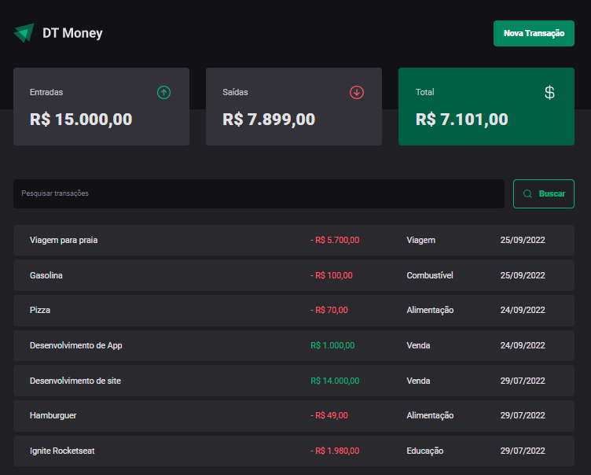

# DT Money

### O projeto consiste em um cadastro de transações sendo elas de entrada ou saída e o cálculo do lucro total
<br>

 <h1 align="center">
    
 </h1>

 ##

 ## Tecnologias utilizadas

 <div style="display: inline_block"><br>
  
  
  
  
  
  
</div>
<br>

##

```bash

#Clone este repositório
$ git clone https://github.com/JoaoPedroVicentin/dt-money.git

#Acesse a pasta do projeto
$ cd DT-Money

#Instale as dependências
$ npm i

#Execute a aplicação em modo de desenvolvimento
$ npm run dev
```
##

<p> Feito por João Pedro Vicentin | <a href="https://www.linkedin.com/in/jo%C3%A3o-pedro-vicentin/">Linkedin</a> </p>
